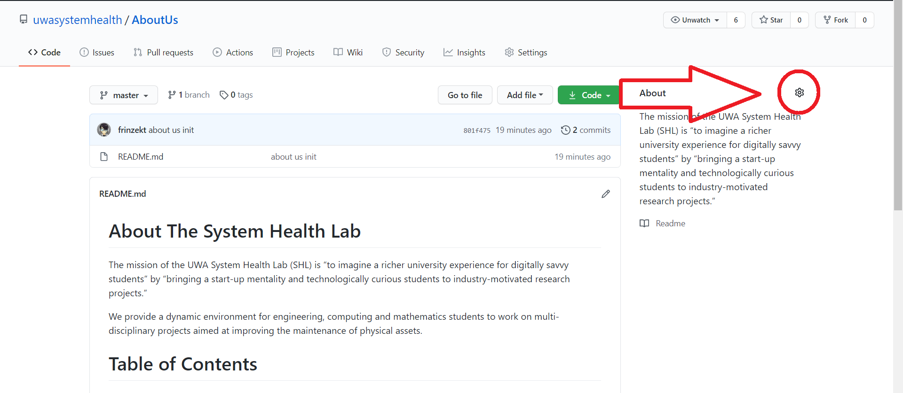
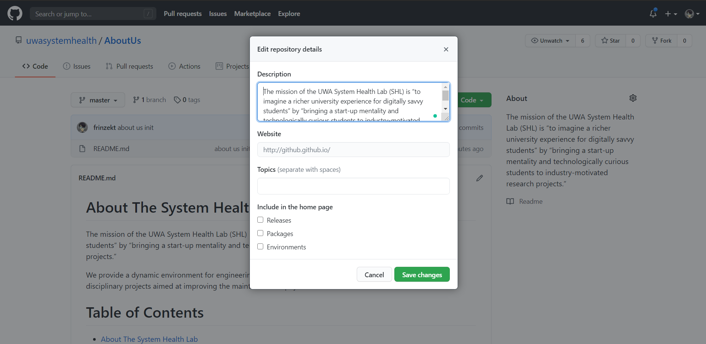

# Organizing Repository (More Info)
- [Organizing Repository (More Info)](#organizing-repository-more-info)
- [Adding Readme](#adding-readme)
- [Adding Description and Tag](#adding-description-and-tag)

# Adding Readme
Create a new file and call it "readme.md", and put information on it.

The common pieces of information that are ideal to have are:
- A paragraph describing your repository
    - What is it about?
    - What is it used for?
    - Author Description
- Table of Contents (if there are a lot of long sections for the repository)
- File Structure (if there are a lot of folders and a structure)
- Installation and Setup Guide (if there is a need for installation)
- Licenses (if there is a declared License)

# Adding Description and Tag
1. Go to your repository

2. Click The Gear Icon On the Right. This will open a form that you could fill up.

1. Add your tags and description for your repository.

